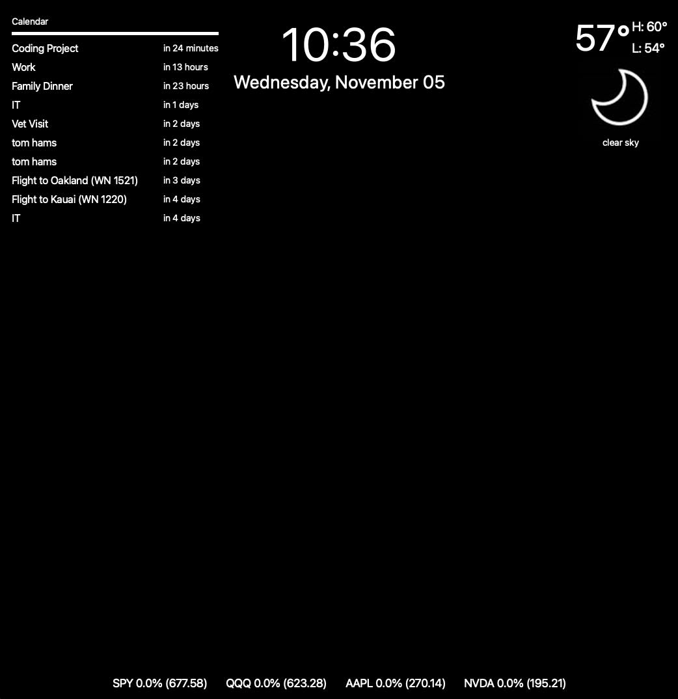

# Smart Mirror – Interactive Personal Dashboard

  
  

This project is a fully custom-built **Smart Mirror system** that combines **hardware craftsmanship** and **software design** into a single, interactive personal dashboard.  
It displays live data such as weather forecasts, Google Calendar events, stock prices, and time updates — all behind a two-way mirror that doubles as a functional display surface.

The software is written in **Python (PySide6 / Qt)**, and the hardware was entirely hand-built — from **disassembling a monitor** to designing and assembling a **custom wooden frame** that holds the LCD panel and two-way mirror.

---

## Overview

The Smart Mirror serves as a real-time information hub, providing an elegant reflection overlayed with dynamic data.  
It fetches and updates live data from external APIs, presenting a seamless always-on interface suitable for home or office environments.

**Features:**
- **Weather display** with custom icons.  
- **Google Calendar integration** for upcoming events.  
- **Stock market tracker** with live pricing.  
- **Real-time clock and date.**  

**Hardware Highlights:**
- Disassembled and repurposed a standard monitor to expose its raw LCD panel.  
- Built a **handcrafted wooden frame** to enclose components neatly.  
- Mounted a **two-way acrylic mirror** for the reflective display effect.  
- Designed concealed cable routing and internal mounting for a clean finish.

---

## Technical Summary

- **Language:** Python  
- **Framework:** PySide6 (Qt for Python)  
- **APIs:**  
  - OpenWeatherMap (weather)  
  - Google Calendar (OAuth2)  
  - Twelve Data (stock market)  
- **UI Components:** Qt Widgets (`QMainWindow`, `QLabel`, `QFrame`, layouts)  
- **Architecture:** Modular scripts for calendar, weather, and stock modules  
- **Supported Platforms:** macOS / Windows  

---

## Development Process

**Hardware Engineering:**  
- Extracted the LCD and driver board from a disassembled monitor.  
- Built a custom frame to mount the LCD behind a two-way mirror.  
- Balanced brightness and reflection for visibility through the mirror.  

**Software Design:**  
- Created the GUI with PySide6 and custom layout logic.  
- Integrated live APIs for weather, calendar, and stock data.  
- Implemented token management for Google Calendar OAuth2.  
- Structured the code modularly (`main.py`, `quickstart.py`, `weather_icon.py`, etc.) for easy maintenance.

---

## Lessons Learned

- Integrating **hardware fabrication** with **software architecture** required cross-domain problem-solving.  
- Managing **live APIs** and long-running processes highlighted the importance of error handling and caching.  
- Precision in **physical assembly** affected overall usability and aesthetics.  
- The project reinforced full-stack thinking — from woodshop tools to network requests.

---

## Future Enhancements

- Add **voice assistant integration** (Google Assistant / local voice commands).  
- Include **home automation** controls (lighting, sensors, thermostat).  
- Introduce **custom UI themes** and scaling options.

---

## Summary

The **Smart Mirror** is both a **hardware and software engineering project** — a showcase of end-to-end system design, combining mechanical construction, electronics integration, and modern Python GUI development.

It demonstrates proficiency in:
- GUI development with PySide6  
- API-driven architecture and OAuth2 authentication  
- Real-time data visualization  
- Practical hardware design and assembly  

This project reflects creativity, technical depth, and the ability to take an idea from concept to physical reality.
